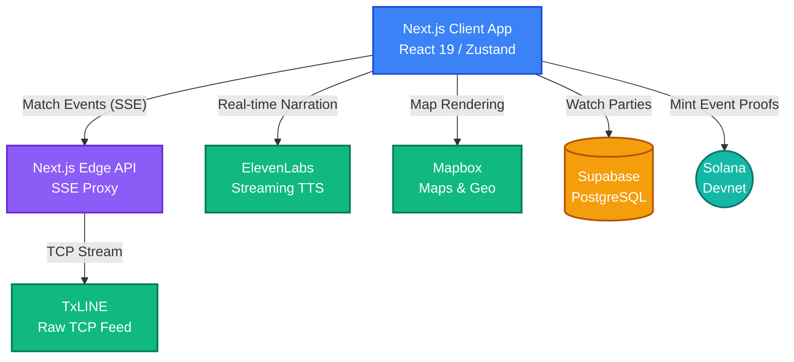

# Pulse

Pulse is a real-time football (soccer) dashboard that ingests live data from TxLINE and visualizes match momentum, odds shifts, and events on an interactive, immersive interface. It includes verifiable event proofs minted on the Solana blockchain, community-focused features, and an AI-driven commentator.

## Features

- **Real-time Event Feed**: Streaming match events with narrative generation and odds impact analysis.
- **Danger Meter**: Dynamic possession visualization indicating the immediate threat level of the current play.
- **Match Replay Engine**: Test and demonstrate system capabilities using historical match data.
- **On-chain Event Proofs**: Verify significant match events on the Solana blockchain directly from the UI.
- **The Analyst (New!)**: A dynamic, picture-in-picture AI football pundit that narrates match events in real-time using ElevenLabs TTS and Web Audio lip-syncing.
- **Watch Party Near Me (New!)**: A community map powered by Mapbox to discover and register local fan watch parties around the world.

## Architecture

Pulse is built using a modern, scalable Web3 technology stack:



- **Frontend Core**: Next.js 16 (App Router) with React 19, offering hybrid SSR/SSG rendering for rapid load times.
- **Styling**: Tailwind CSS combined with highly-customized CSS variables for a dynamic, modern aesthetic.
- **State Management**: Zustand for global, lightning-fast store updates (essential for processing the high-frequency event stream).
- **Live Data Ingestion**: Next.js Edge API routes handle Server-Sent Events (SSE), bridging raw TxLINE data directly to the client.
- **Geospatial & Community**: Mapbox SDK (`react-map-gl/mapbox`) handles watch party localization, with Supabase (PostgreSQL) managing geospatial storage and CRUD operations.
- **AI Integration**: ElevenLabs Streaming API and native Web Audio APIs are used for real-time TTS narration and synchronized lip-sync amplitude analysis.
- **Blockchain/Web3**: Solana Web3.js and Anchor handle the minting of on-chain verifiable event proofs.

---

## Getting Started

### 1. Prerequisites

Before running the application, you'll need API keys for the following services:
- **Supabase**: For database hosting (Watch Parties feature).
- **Mapbox**: For rendering maps (Watch Parties feature).
- **ElevenLabs**: For AI voice generation (The Analyst feature).

### 2. Environment Variables

Create a `.env.local` file in the root directory and add the following variables:

```env
# Mapbox
NEXT_PUBLIC_MAPBOX_TOKEN=your_mapbox_public_token

# Supabase
NEXT_PUBLIC_SUPABASE_URL=your_supabase_project_url
NEXT_PUBLIC_SUPABASE_ANON_KEY=your_supabase_anon_key
SUPABASE_SERVICE_ROLE_KEY=your_supabase_service_key

# ElevenLabs (The Analyst)
ELEVENLABS_API_KEY=your_elevenlabs_api_key
ELEVENLABS_VOICE_ID=your_elevenlabs_voice_id
ELEVENLABS_MODEL_ID=eleven_flash_v2_5

# Solana & Dev
NEXT_PUBLIC_SOLANA_NETWORK=mainnet-beta
NEXT_PUBLIC_SOLANA_RPC=https://api.mainnet-beta.solana.com
NEXT_PUBLIC_DEMO_FIXTURE_ID=18202701
```

### 3. Database Setup

To use the Watch Party Near Me and Fan Profile (Form Score) features, you need to configure your Supabase database:

1. Open your Supabase Dashboard and navigate to the **SQL Editor**.
2. Run the SQL script located in `scripts/setup_watch_parties.sql` to enable Watch Parties.
3. Run the SQL script located in `scripts/setup_fan_profiles.sql` to enable Fan Profiles and Form Scores.
*(Note: If the tables aren't created, the application has local fallbacks so demos won't break!)*

### 4. Running the Development Server

Install dependencies and start the Next.js development server:

```bash
npm install
npm run dev
```

Open [http://localhost:3000](http://localhost:3000) in your browser.

---

## Known Limitations

- **Replay speed is approximate.** Historical batch events are dispatched at a fixed interval rather than true wall-clock timing. A 5-minute batch that had 3 events fires them evenly spaced — in reality they may have been bunched in 30 seconds. The emotional arc is accurate; the exact timing is not.
- **Lineup formation is inferred, not sourced.** TxLINE provides player position IDs and unit IDs but not a formation string (e.g. "4-3-3"). The formation label is derived from grouping players by unitId. It is correct for standard shapes but occasionally wrong for teams using hybrid shapes.
- **On-chain proof runs asynchronously.** Verification can lag 10–30 seconds depending on Solana devnet congestion. We do not block the UI while waiting for confirmation.
- **SSE proxy adds one network hop.** We tunnel the raw TxLINE TCP feed through a Next.js Edge route to convert it to SSE for the browser. In production, a dedicated WebSocket gateway in Rust or Go would slice 20-40ms off the delivery time.

## What's Next

- **Predictive Event Queuing:** Using historical sequences to pre-warm the UI for likely upcoming events before the TCP packet arrives.
- **Deep Solana Integration:** Minting the verifiable event proofs as compressed NFTs (cNFTs) to serve as a persistent "Fan Passport" across the ecosystem.
- **Micro-Betting Hooks:** Exposing the raw odds stream to a smart contract to allow localized, in-play wagers on the next 5-minute event window.
