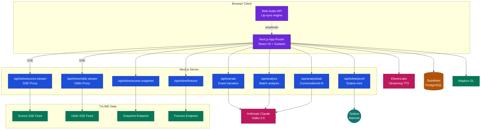
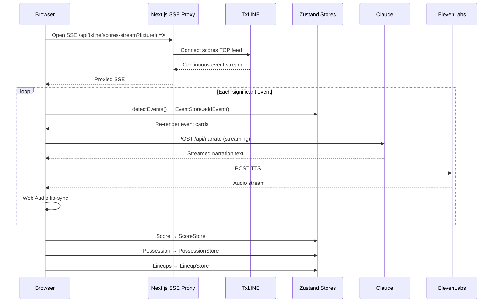
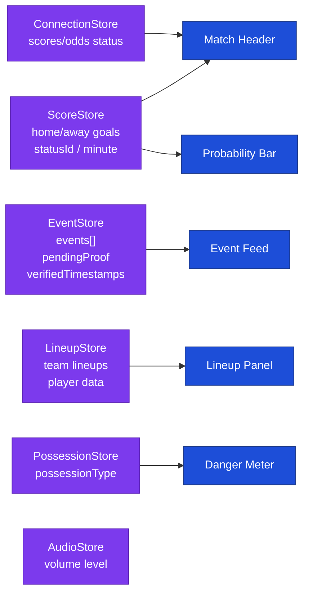

# Alani

> **The second screen football actually deserves.**
> Real-time match intelligence, on-chain fan moments, and an AI analyst — built on verified live data from TxLINE.

---

## Built on Real Fan Insight

Alani didn't start with a feature list. It started with a problem: **the official World Cup 2026 app is genuinely terrible, and the broader category of "fan experience apps" is full of novelty that doesn't solve anything real.**

### The Research: 2026 World Cup Fan Frustrations

Before writing a single line of code, the founding research mapped real pain points from fans during the 2026 World Cup (ongoing across the US, Canada, and Mexico) — sourced from X/Twitter communities, app store reviews, and direct supporter feedback.

#### What fans actually complained about

**The Official App**
- Buggy, laggy navigation that traps users in dead ends
- Poor onboarding that forces a FIFA ID before showing anything useful
- Schedule view capped at ~6 fixtures with no deep filtering
- Heavy ads overlaid on actual content
- No deep stats, no player comparisons, no formation data
- Ticket management that fails at critical moments — missing tickets, broken transfers, separate apps required for different functions
- Near-universally called one of the worst major tournament apps ever shipped

**Ticketing & Access**
- Dynamic pricing with unchecked scalping driving face-value tickets out of reach
- Visa refusals blocking travelling fans and even players' families
- Enormous stadiums (NFL-scale) sitting with visible empty blocks despite "sold out" labels

**Matchday & Stadium Experience**
- Overpriced food, transport, and accommodation
- Poor pitch quality in several venues
- Hydration and ad breaks killing match momentum at critical moments
- Bad kick-off times for fans outside the host continent
- Suspicious VAR decisions with zero explanation provided to fans in-stadium or at home
- An overwhelming "TV-first, commercial-first" feel that prioritises broadcaster revenue over supporter atmosphere

**Watching From Home**
- Awful broadcast windows for fans outside North America
- Ad-saturated streams with no opt-out
- No real-time stats beyond goals and yellow cards
- No way to feel connected to other fans watching the same game across time zones

#### The Six Questions Alani Was Built to Answer

This research produced six specific questions — each a real fan experience gap — that shaped every feature decision:

---

**1. "I can't be at the stadium and my TV feels lonely — how do I feel the crowd?"**

The insight: what fans miss most watching alone isn't information, it's *feeling the room react with you*. Alani's live event feed and AI narration turn TxLINE's real-time odds-swing data into a shared atmospheric signal — rising tension you can *feel* in the card, not just read in the score.

---

**2. "VAR just overturned a goal and nobody explains why — I just feel robbed."**

The insight: VAR controversy isn't anger at the decision, it's anger at the opacity. The instant a score event reverses, Alani surfaces a plain-language explanation *plus* the real-time odds swing — showing not just *what* happened but *how much it mattered*, quantified. This reframes "the refs robbed us" into "here's the actual stakes of that decision."

---

**3. "I fell asleep during the late kickoff — how do I catch up without a boring highlight reel?"**

The insight: a highlight reel is curated by someone else's idea of what mattered. A replay built from score and odds *volatility* reconstructs the emotional arc as it actually happened. That's the Replay Engine — events in order, weighted by real impact.

---

**4. "My friends are scattered across three continents — how do we watch 'together'?"**

The insight: the international kickoff problem is fundamentally async. Watch parties built around real-time chat don't work across time zones. Alani's Watch Party Near Me addresses the local side; the Async Watch Party in the roadmap addresses the global async problem.

---

**5. "I only care about one team — why is every app built for the neutral fan?"**

The insight: most sports apps display everything equally. TxLINE's normalized cross-competition schema makes it possible to surface what matters *specifically to you* — your team's odds movement, fixture context, player stats — rather than a generic everything-feed.

---

**6. "I don't follow football closely enough to have opinions — I just want to belong in the conversation."**

The insight: every World Cup cycle brings tens of millions of casual, first-time viewers not served by deep-stats products. Alani's Technical Analysis and the roadmap "Adopt a Team" feature are explicitly for fans who need just enough context — one storyline, one player, one stat — to feel like they're part of it.

#### The Filter That Matters

> *"If the idea would work identically with any sports API, you haven't used what makes TxLINE actually different."*

Every feature in Alani passes this test. TxLINE provides real-time, normalized data across all fixtures simultaneously, with cryptographically verifiable timestamps. That specific combination — cross-competition, real-time, cryptographically anchored — is what makes on-chain event proofs, instant AI narration tied to exact match-clock moments, and replay reconstruction from verified event sequences *possible* in Alani, and not possible with a generic sports API.

---

## What Alani Is

Alani is a **real-time football companion app** for the 2026 World Cup and beyond. It streams live match data from TxLINE, runs AI analysis via Claude (Anthropic), mints verifiable fan moments on Solana, and surfaces community features through Supabase.

| Pillar | What it does |
|---|---|
| **Live Intelligence** | Real-time event feed with AI narration, danger meter, probability curve |
| **On-Chain Proof** | Mint significant match events as verifiable Solana transactions |
| **Replay Engine** | Navigate completed match timelines with Alani AI tactical breakdown |
| **Fan Profile** | Wallet-linked identity, verified moments, Form Score |
| **Community** | Watch party map, geo-based fan discovery |

---

## Features

### Live Match Page (`/match/[fixtureId]`)
- **Real-time event feed** — streams TxLINE's SSE scores channel; renders every significant action (goals, cards, VAR, substitutions, shots, corners, fouls) with AI-narrated captions
- **Danger Meter** — possession-type visualisation (safe → danger → high danger → attack) driven by TxLINE's `PossessionType` field
- **Live probability bar** — home win / draw / away win percentages in real-time from TxLINE odds stream
- **Probability curve** — historical win probability chart across match duration from odds snapshot
- **Lineup panel** — starting XIs resolved from TxLINE's `lineups` SSE action
- **On-chain event proofs** — any significant event can be minted as a Solana transaction with the TxLINE timestamp embedded; verifiable permanently
- **The Analyst** — AI pundit avatar voiced via ElevenLabs TTS with Web Audio lip-sync amplitude analysis, narrating events in real-time

### Match Replay Page (`/replay`)
- **Event timeline** — all significant actions from a completed match, split into First Half / Second Half / Extra Time
- **Playback controls** — play, pause, skip, clickable scrub bar to jump to any point
- **Running score per goal** — each goal event shows the score at that exact moment
- **Team attribution** — all events labelled home/away using TxLINE's `Participant` field
- **Event details** — goal type (header, tap-in), VAR outcome (overturned/upheld), shot on/off target, substitution player IDs
- **Alani Technical Analysis** — one-click streaming AI tactical breakdown using Claude, rendered in real-time Markdown
- **Ask Alani** — conversational AI assistant (unlocks after analysis completes) for match questions

### Home Page (`/`)
- Live matches with real-time score and danger indicator
- Completed matches with final scores and replay links
- Scheduled matches with kickoff times
- Kickoff reminder notifications

### Fan Profile (`/profile`)
- **Wallet-linked identity** — connect Solana wallet for persistent fan identity
- **Form Score** — engagement metric from verified on-chain moments
- **Verified Moments** — history of on-chain proofs with match names resolved from fixture metadata

### Watch Party Near Me
- Mapbox-powered global map of fan watch parties
- Create, discover, and RSVP to local events
- Geo-based filtering

---

## Architecture

### System Overview



### Live Match Data Flow



### Zustand State Architecture



### Key Technical Decisions

| Decision | Rationale |
|---|---|
| **SSE over WebSocket** | TxLINE exposes a TCP SSE feed; Next.js Edge routes proxy it cleanly without raw socket management |
| **Zustand over Context/Redux** | High-frequency TxLINE updates (~800ms) need zero-overhead state. `getState()` outside React avoids re-render thrashing in hot paths |
| **Streaming AI via ReadableStream** | Claude and ElevenLabs responses stream directly to the client — no buffering, no waiting for full completion |
| **Score from `Score` object, never `Stats`** | TxLINE's `Stats` numeric keys map to different things per context — `Stats['2']` is **corners**, not goals. We exclusively read from the `Score` object |
| **Solana Devnet** | On-chain event proofs are minted on devnet during development. Swapping to mainnet is a single env var change when ready to ship |

---

## Getting Started

### Prerequisites

API keys for: TxLINE, Anthropic, Supabase, Mapbox, ElevenLabs

### Environment Variables

Create `.env.local` in the project root:

```env
# TxLINE
TXLINE_API_ORIGIN=https://txline-dev.txodds.com
TXLINE_API_BASE=https://txline-dev.txodds.com/api
TXLINE_DEV_JWT=your_txline_dev_jwt
TXLINE_DEV_API_TOKEN=your_txline_api_token

# Anthropic
ANTHROPIC_API_KEY=your_anthropic_api_key

# Supabase
NEXT_PUBLIC_SUPABASE_URL=your_supabase_project_url
NEXT_PUBLIC_SUPABASE_ANON_KEY=your_supabase_anon_key
SUPABASE_SERVICE_ROLE_KEY=your_supabase_service_key

# ElevenLabs
ELEVENLABS_API_KEY=your_elevenlabs_api_key
ELEVENLABS_VOICE_ID=your_voice_id
ELEVENLABS_MODEL_ID=eleven_flash_v2_5

# Mapbox
NEXT_PUBLIC_MAPBOX_TOKEN=your_mapbox_public_token

# Solana
NEXT_PUBLIC_SOLANA_NETWORK=devnet
NEXT_PUBLIC_SOLANA_RPC=https://api.devnet.solana.com
DEV_WALLET_PUBKEY=your_dev_wallet_pubkey
DEV_WALLET_SECRET=your_dev_wallet_secret_base64

# Demo
NEXT_PUBLIC_DEMO_FIXTURE_ID=18202701
```

### Database Setup

Run from the Supabase SQL Editor:

```bash
scripts/setup_watch_parties.sql   # Watch Party Near Me
scripts/setup_fan_profiles.sql    # Fan Profiles & Form Score
```

> App has graceful fallbacks if tables aren't present — demos won't break.

### Run

```bash
npm install
npm run dev
# Open http://localhost:3000
```

---

## Tech Stack

| Layer | Technology |
|---|---|
| Framework | Next.js 16.2 (App Router) |
| UI | React 19, Tailwind CSS v4, Lucide React |
| State | Zustand 5 |
| Live Data | TxLINE SSE → Next.js Edge proxy |
| AI | Anthropic Claude (Haiku 4.5) |
| Voice | ElevenLabs Streaming TTS + Web Audio API |
| Database | Supabase (PostgreSQL) |
| Maps | Mapbox GL / react-map-gl |
| Blockchain | Solana Web3.js + Anchor (devnet) |
| Charts | Recharts |
| Markdown | react-markdown |

---

## Known Limitations

**Replay speed is approximate.** Historical batch events are dispatched at a fixed interval. A real burst of three events in 30 seconds will be spread evenly across the replay tick. The emotional arc is accurate; the exact timing is not.

**Replay player names show as IDs.** TxLINE's `scores/snapshot` endpoint for historical matches doesn't include lineup data — that arrives only via the `lineups` SSE action during a live match. Player IDs appear as `#ID` in replay; team attribution (home/away) is derived correctly from the `Participant` field.

**Formation inference.** TxLINE provides player position and unit IDs but no formation string. Formation labels are derived from grouping players by `unitId`. Correct for standard shapes; occasionally wrong for hybrid formations.

**On-chain proof is async.** Solana devnet confirmation can lag 10–30 seconds under network congestion. The UI does not block while waiting.

**SSE proxy adds one hop.** The Next.js Edge route adds a network hop between TxLINE and the browser. A dedicated WebSocket gateway in Rust or Go would cut 20–40ms in production.

---

## TxLINE Endpoints Used

All requests are authenticated with two headers: `Authorization: Bearer <JWT>` and `X-Api-Token: <apiToken>`. The JWT is obtained from `POST /auth/guest/start` and expires after 30 days. Both headers are required on every data call.

### Auth

| Endpoint | Method | Description |
|---|---|---|
| `POST /auth/guest/start` | REST | Obtain a guest JWT. Returns `{ token }`. No body required. Used as a fallback when no `TXLINE_DEV_JWT` env var is set. |
| `POST /api/token/activate` | REST | Activate an API token after on-chain subscription. Returns `{ jwt, apiToken }`. Currently stubbed in development. |

### Fixtures

| Endpoint | Method | Params | Fields used |
|---|---|---|---|
| `GET /api/fixtures/snapshot` | REST | `startEpochDay`, optional `endEpochDay`, `statusId` | `FixtureId`, `Participant1`, `Participant2`, `Competition`, `StartTs`, `StatusId` |

We default `startEpochDay` to 14 days before today when not supplied so the home page always shows recent results.

### Scores

| Endpoint | Method | Params | Fields used |
|---|---|---|---|
| `GET /api/scores/stream` | SSE | `fixtureId` | `Action`, `Ts`, `StatusId`, `Clock.Seconds`, `Score.Participant1/2.Total.Goals`, `PossessionType`, `PossibleEventSoccer`, `Data`, `Lineups`, `Participant1Id`, `Participant2Id` |
| `GET /api/scores/snapshot/{fixtureId}` | REST | path: `fixtureId` | Same fields as stream; used for cold-start hydration on match page and full event reconstruction in the Replay Engine |
| `GET /api/scores/history/{fixtureId}` | REST | `epochDay`, `hour`, `minute` | Full historical event array; reserved for time-travel queries |
| `GET /api/scores/proof/{fixtureId}` | REST | `epochDay`, `ts` | Cryptographic proof object; embedded as `stat_a` in the on-chain Anchor transaction |

**Key field notes from the scores stream:**

- `Action` — string tag identifying the event type (`lineups`, `goal`, `substitution`, `var_start`, `var_end`, `yellow_card`, `red_card`, `shot`, `corner`, `foul`, `additional_time`, `safe_possession`, `attack_possession`, `danger_possession`, `high_danger_possession`, `hydration_break`, `kickoff`, `halftime`, `fulltime`)
- `Score.Participant1/2.Total.Goals` — **this is the authoritative goal count.** `Stats` keys (numeric) are contextual and do NOT reliably map to goals — e.g. `Stats['2']` is corners, not goals.
- `StatusId` — `1`=pre, `2`=1st half, `3`=HT, `4`=2nd half, `5`=FT, `6`=1st ET, `7`=2nd ET, `8`=ET HT, `9`=Pens
- `Clock.Seconds` — match clock in seconds from kick-off; divide by 60 for display minute
- `Participant1Id` / `Participant2Id` — numeric IDs identifying home/away teams; used for team attribution on all events
- `Lineups` — only present on the `lineups` action; contains `preferredName`, `positionId`, `unitId`, `starter`, `rosterNumber` per player. **Only arrives during a live match — historical snapshots of completed matches do not include lineup data.**
- `PossessionType` — drives the Danger Meter: `SafePossession`, `AttackPossession`, `DangerPossession`, `HighDangerPossession`
- `Data.Outcome` — on shot events: `OnTarget` or `OffTarget`
- `Data.PlayerId` / `Data.PlayerInId` / `Data.PlayerOutId` — player IDs on goals, subs, cards

### Odds

| Endpoint | Method | Params | Fields used |
|---|---|---|---|
| `GET /api/odds/stream` | SSE | `fixtureId` | Win probability percentage array `[Home%, Draw%, Away%]`; `InRunning` boolean |
| `GET /api/odds/snapshot/{fixtureId}` | REST | path: `fixtureId` | Same probability array structure; used for the probability curve chart on the match page |
| `GET /api/odds/history/{fixtureId}` | REST | `epochDay`, `hour`, `minute` | Time-series probability history; reserved for historical curve reconstruction |

**Note:** On the devnet environment, odds data is sparse for many fixtures. The `match-highlights` route detects an empty odds response and synthesises a plausible probability curve from the score timeline (score differential + time elapsed). This fallback makes the chart functional during development.

---

## Developer Experience: Building on TxLINE

### What we loved

**The SSE feed design is genuinely excellent.** Piping a TCP SSE stream through a Next.js Edge route to the browser is five lines of code — `upstreamResponse.body` passes straight through as a `ReadableStream`. We were streaming live events to the UI within the first hour of touching the API. The `Last-Event-ID` reconnection header worked out of the box, so we got resilient reconnection for free.

**The `Action` field makes event parsing trivial.** Every event in the scores stream carries a plain-English `Action` string. There is no magic numeric code to map — you read `"goal"` and you know it is a goal. This made building the event detection logic fast and readable. The possession actions (`safe_possession`, `danger_possession` etc.) are a particularly good design — they let us build the Danger Meter in minutes.

**The cross-competition normalised schema is the real product.** The fixtures, scores, and odds endpoints all use the same field shapes regardless of competition. We could switch between World Cup group stages and knockout rounds without changing a line of parsing code. This is the core thing that makes the Longshot and Recap Engine roadmap items feasible — you genuinely can watch all fixtures simultaneously from one normalised feed.

**The `Score` object is reliable.** `Score.Participant1.Total.Goals` is always the right number. It never lies. Once we understood to use this and never `Stats`, score handling became solid.

**Free tier is generous.** Service level 12 (real-time World Cup data, no delay) costs zero TxL tokens. Getting real-time live match data for free during a hackathon is a huge advantage. It meant we could build something real instead of mocking data.

**The proof endpoint is a great idea.** `GET /api/scores/proof/{fixtureId}?epochDay=X&ts=Y` returns a cryptographic proof tied to a specific event timestamp. The design intention — embed this in an on-chain transaction to create a permanently verifiable fan moment — is exactly right. The concept of the data feed being the source of truth for the proof is elegant.

---

### Where we hit friction

**`Stats` numeric keys are a trap.** The scores stream emits a `Stats` object with numeric string keys (`"1"`, `"2"`, `"3"` etc.). There is no inline documentation on what each key means. Early in development we read `Stats['2']` and saw it increment — and assumed it was goals. It is corners. This caused a multi-session debugging spiral before we worked out that the correct path is always `Score.Participant1.Total.Goals`. **The fix: ignore `Stats` entirely for score tracking.** This needs to be front-and-centre in the documentation because the footgun is invisible — the value increments at plausible times.

**Historical snapshots don't include lineup data.** `GET /api/scores/snapshot/{fixtureId}` for a completed match returns no `lineups` action item. The lineup data is only emitted live via SSE during the match itself. This means replay player names cannot be resolved from the snapshot — they appear as `#ID`. We accepted this as a known limitation, but it is a meaningful gap for any post-match feature. A `GET /api/lineups/{fixtureId}` REST endpoint returning the starting XI and subs for any completed match would unlock a lot.

**Odds data is sparse on devnet.** Many fixtures return an empty array from `GET /api/odds/snapshot/{fixtureId}`. We wrote a score-based probability simulation as a fallback, but it is obviously synthetic. A richer devnet dataset — even just one or two complete fixtures with full odds history — would have made development smoother.

**The two-token auth model requires careful reading.** Both `Authorization: Bearer <JWT>` and `X-Api-Token: <apiToken>` are required on every call — but the consequence of getting this wrong is a cryptic 401 with no body explaining which header is missing. It took a session to fully understand the relationship between the guest JWT, the API token, and the on-chain subscription. Better error messages (e.g. `"X-Api-Token missing or expired"` vs `"JWT expired"`) would halve the debug time.

**JWT expiry handling requires proactive code.** The JWT expires in 30 days and the only signal is a 401 response. We added auto-refresh logic in the proof proxy (catch 401 → call `getGuestJWT()` → retry) but this pattern needs to be replicated in every proxy route. A token refresh endpoint or a short-lived token + refresh token pattern would be cleaner.

**The `activate` flow is a Stage 6 stub.** The `POST /api/token/activate` endpoint (wallet signature → JWT + apiToken) is documented in the auth module but the on-chain verification is not yet implemented. For the hackathon we used a dev JWT directly, which works — but the intended end-to-end flow (fan subscribes on-chain → wallet-gated API access) couldn't be completed. This is the most exciting part of the TxLINE proposition and it would be worth a reference implementation.

---

## Roadmap

*Every item below passes the same research filter: does it solve a real fan problem that TxLINE's specific data shape makes uniquely possible?*

### Longshot — Underdog Discovery Engine
Watches odds drift across *all active fixtures simultaneously* and surfaces the moment a rank outsider becomes a genuine threat. One feed: *"A team you've never heard of just became a 40% chance to beat a former champion — watch now."* Turns TxLINE's cross-competition normalised schema into the product itself.

### The Recap Engine
Reconstructs the emotional arc of a missed match from score and odds *volatility* — pacing the spoiler reveal so tension builds the way it did live, even six hours later. Requires companion video content synced to TxLINE timestamps; the data infrastructure already exists.

### Async Watch Parties
Friends record short reactions pinned to match-clock timestamps. The app surfaces your friend's reaction at the exact moment *you* reach that point — even if they watched eight hours earlier. TxLINE's verified timestamps make "the exact moment" possible. Core constraint: spoiler management must be ironclad.

### Adopt a Team
For casual fans. A 30-second quiz assigns a team for the tournament, then feeds just enough context before each match — one storyline, one player to watch, one stat that matters. Explicitly the top-of-funnel feature built for the millions of newcomers every World Cup brings.

### Pulse — Shared Atmosphere Layer
TxLINE's odds-swing data becomes a wordless crowd signal: a colour shift and shared gasp animation firing the instant a stat swings hard — synced to the exact event timestamp so it feels simultaneous across time zones. Lives or dies on latency; if the "shared gasp" lands 8 seconds late, the product breaks.

### Deep Solana Integration
Upgrade on-chain event proofs from raw transactions to compressed NFTs (cNFTs), creating a persistent **Fan Passport**. Each minted moment becomes a collectible credential with the verified TxLINE timestamp as the source of truth.

